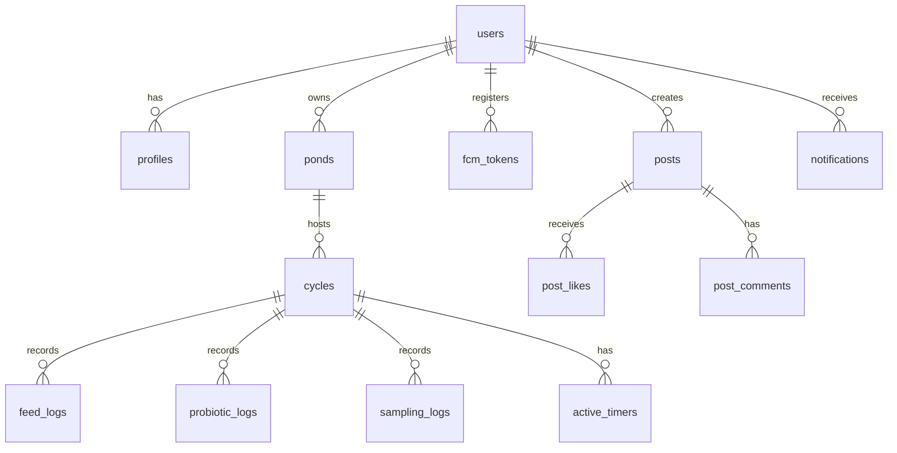

<!-- Database schema detail: tabel, relasi, field types, dan views -->

# DATA-MODEL — Database Schema & RLS (PRIMA)

> **Status:** Dokumen ini mencerminkan struktur skema Supabase yang AKTUAL dari folder `supabase/migrations/*`.
> **Database:** PostgreSQL (via Supabase)  
> **Terakhir Diperbarui:** 25 Agustus 2026  

---

## 1. Overview & Arsitektur Keamanan

Database PRIMA didesain dengan konsep **Multi-Tenant terselubung** menggunakan **Row Level Security (RLS)** bawaan PostgreSQL/Supabase.
- Tabel yang menyimpan data pribadi (*ponds*, *cycles*, *logs*) memiliki kolom `user_id`.
- RLS Policy secara tegas membatasi agar *User A* tidak bisa melakukan `SELECT/INSERT/UPDATE/DELETE` terhadap baris milik *User B*.
- Operasi database dari Next.js (Server Actions) menggunakan identitas *user* yang aktif via Supabase SSR client.

---

## 2. Entity Relationship Diagram (ERD)



*(Keterangan: `users` adalah tabel bawaan Supabase `auth.users`)*

---

## 3. Core Tables (Manajemen Kolam & Siklus)

### 3.1 `profiles`
Ekstensi dari `auth.users` untuk menyimpan profil publik petambak.
- **Kolom Utama:** `id` (PK, FK ke auth.users), `full_name`, `farm_name`, `location`, `avatar_url`, `created_at`, `updated_at`.
- **Relasi:** 1:1 dengan `auth.users`.

### 3.2 `ponds`
Menyimpan data kolam fisik milik petambak.
- **Kolom Utama:** `id` (PK), `user_id` (FK), `name`, `area_m2` (Luas m²), `depth_m` (Kedalaman), `location`.
- **Relasi:** Dimiliki oleh user. Satu user bisa punya banyak kolam.

### 3.3 `cycles`
Menyimpan data siklus tebar (masa budidaya) di dalam sebuah kolam.
- **Kolom Utama:** `id` (PK), `pond_id` (FK), `initial_shrimp_count` (Populasi tebar), `shrimp_type` (default 'vaname'), `start_date`, `end_date`, `status` (Aktif/Selesai).
- **Kolom Panen (Hasil Akhir):** `harvest_total_kg`, `harvest_fcr`, `harvest_biomass_kg`, `harvest_sr_pct`.
- **Kolom Cache (Denormalisasi via Cron/Trigger):** `current_abw_gram`, `current_biomass_kg`.
- **Kolom Konfigurasi (JSON):** `plan` (Untuk menyimpan modifikasi manual rekomendasi pakan dari user).

---

## 4. Logbook Tables (Pencatatan Harian)

### 4.1 `feed_logs`
Mencatat sejarah tebar pakan harian & evaluasi anco.
- **Kolom Utama:** `id` (PK), `cycle_id` (FK), `date`, `feed_amount_kg` (Jumlah pakan aktual), `feed_type` (Pelet, dll), `brand`.
- **Kolom Evaluasi Anco:** `anco_result` (Enum: Habis, Sisa Sedikit, Sisa Banyak, Belum Dicek), `anco_checked_at` (Timestamp).

### 4.2 `probiotic_logs`
Mencatat aplikasi probiotik.
- **Kolom Utama:** `id` (PK), `cycle_id` (FK), `date`, `amount_ml`, `brand`, `method` (Campur Pakan / Ke Air).

### 4.3 `sampling_logs`
Mencatat hasil jala sampel mingguan untuk mengoreksi ABW dan Biomassa AI.
- **Kolom Utama:** `id` (PK), `cycle_id` (FK), `date`, `shrimp_count` (Jml ditimbang), `total_weight_gram` (Total berat timbangan), `abw_gram` (Otomatis: total/count), `estimated_sr_pct` (Perkiraan SR saat jala).

---

## 5. Notification & Alarm Tables

### 5.1 `active_timers`
Sistem antrean state-machine untuk alarm Anco dan Pakan.
- **Kolom Utama:** `id`, `user_id`, `cycle_id`, `timer_type` (anco/feed), `fire_at` (Waktu meledak), `status` (pending/notified/completed/dismissed/escalated).
- **Kolom Eskalasi:** `notified_at`, `escalated_at` (Digunakan jika user mengabaikan notifikasi).

### 5.2 `fcm_tokens` & `device_tokens`
Menyimpan token Firebase Cloud Messaging untuk push notification.
- **`fcm_tokens`:** Relasi ke `user_id` untuk notifikasi push terautentikasi.
- **`device_tokens`:** Menyimpan preference device dan kapabilitas native.

### 5.3 `notifications`
Mencatat riwayat notifikasi in-app (Lonceng UI).
- **Kolom Utama:** `id`, `user_id`, `title`, `body`, `type` (info/alert/community), `is_read`, `created_at`.

---

## 6. Social & Community Tables

### 6.1 `posts`
Postingan timeline komunitas.
- **Kolom Utama:** `id`, `user_id`, `content`, `image_url`, `created_at`.

### 6.2 `post_likes`
Sistem Like / Upvote.
- **Kolom Utama:** `post_id`, `user_id`, `created_at` (Composite Key: post_id + user_id agar tidak double like).

### 6.3 `post_comments`
Komentar di bawah postingan.
- **Kolom Utama:** `id`, `post_id`, `user_id`, `content`, `created_at`.

---

## 7. AI & Analytics

### 7.1 `ai_training_data`
Tabel pencatatan siklus sukses untuk proses kalibrasi AI historis.
- **Deskripsi:** Ketika siklus diakhiri dengan FCR sehat, trigger/function akan mencatat rangkuman (summary) dari siklus tersebut ke tabel ini sebagai *dataset* bagi sistem AI (SSOT Historis).

### 7.2 Views (Database Virtual Tables)
- **`v_ai_ready_dataset`**: View yang membersihkan dan memformat data `ai_training_data` agar siap dicerna langsung oleh model AI / Gemini.
- **`v_user_fcr_ranking`**: View agregasi untuk menghitung rata-rata FCR per pengguna (digunakan untuk leaderboard / *gamification*).
- **`v_community_feed`**: View yang menggabungkan `posts`, profil penulis, jumlah like, dan jumlah komentar menjadi satu JSON (untuk efisiensi *query* di halaman `/komunitas`).

---

## 8. Row Level Security (RLS) Rules

Aturan standar yang diterapkan di *hampir seluruh* tabel:
```sql
ALTER TABLE [nama_tabel] ENABLE ROW LEVEL SECURITY;

-- Hak CRUD hanya untuk pemilik data
CREATE POLICY "Users can CRUD own data" ON [nama_tabel]
  FOR ALL USING (auth.uid() = user_id);
```

**Pengecualian RLS (Public / Community):**
- `profiles` : Bisa di-*select* oleh siapa saja yang *authenticated* (karena profil ditampilkan di post/komunitas), tapi hanya bisa di-*update* oleh pemilik.
- `posts`, `post_comments` : Bisa dibaca oleh semua user yang login, tapi aksi delete/update hanya oleh *author*.
